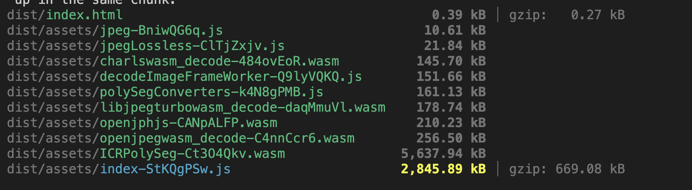
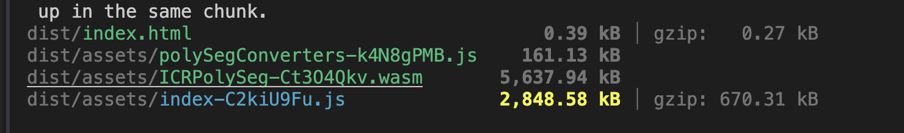

# React + Vite + Cornerstone3D

## ES Module dev + build

Seems like if we use the esm version of the cornerstone dicom image loader 
vite will bundle the wasm files itself by default

```
export default defineConfig({
  plugins: [react()],
  worker: {
    format: "es",
  },
  server: {
    headers: {
      "Cross-Origin-Opener-Policy": "same-origin",
      "Cross-Origin-Embedder-Policy": "require-corp",
    },
  },
  // seems like only required in dev mode
  assetsInclude: ["**/*.wasm"],
})

```

here will be the bundle 




Seems like build works fine. and you can do `npm run preview` and see everything works.

But the dev in vite uses esbuild and it has some worker import.meta.url issues still

https://github.com/vitejs/vite/issues/8427

and I'm not able to make the `dev` work still

## UMD dev + build

However if we use an alias for umd the build seems like does not bring the 
decoder wasm to the dist


```
export default defineConfig({
  plugins: [react()],
  worker: {
    format: "es",
  },
  resolve: {
    alias: {
      "@cornerstonejs/dicom-image-loader":
        "@cornerstonejs/dicom-image-loader/dynamicumd",
    },
  },
  server: {
    headers: {
      "Cross-Origin-Opener-Policy": "same-origin",
      "Cross-Origin-Embedder-Policy": "require-corp",
    },
  },
  // seems like only required in dev mode
  assetsInclude: ["**/*.wasm"],
})
```

here will be the bundle



as you see only the cornerstone tools wasm (not the decoder wasm) is in the dist. 

For umd we should static copy those files to the dist folder.

```
import { defineConfig } from "vite"
import react from "@vitejs/plugin-react"
// static copy
import { viteStaticCopy } from "vite-plugin-static-copy"
import path from "path"
import { normalizePath } from "vite"

// https://vitejs.dev/config/
export default defineConfig({
  plugins: [
    react(),
    viteStaticCopy({
      targets: [
        {
          src: normalizePath(
            path.resolve(
              __dirname,
              "node_modules/@cornerstonejs/dicom-image-loader/dist/dynamic-import/*"
            )
          ),
          dest: "assets",
        },
      ],
    }),
  ],
  worker: {
    format: "es",
  },
  resolve: {
    alias: {
      "@cornerstonejs/dicom-image-loader":
        "@cornerstonejs/dicom-image-loader/dynamicumd",
    },
  },
  server: {
    headers: {
      "Cross-Origin-Opener-Policy": "same-origin",
      "Cross-Origin-Embedder-Policy": "require-corp",
    },
  },
  // seems like only required in dev mode
  assetsInclude: ["**/*.wasm"],
})
```
